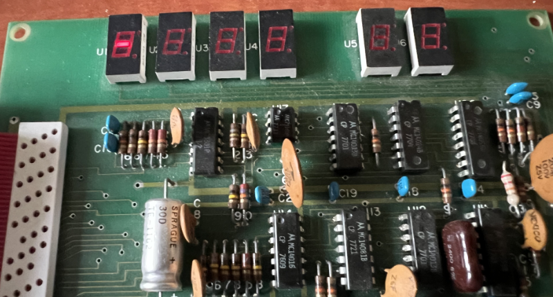
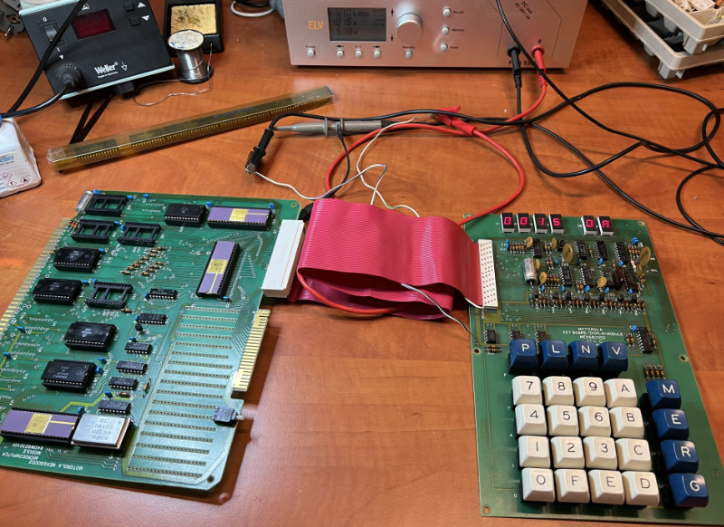

## How it all started

When I was in elementry school, my friend Rick had an uncle who was radio amateur.
One day I came along with my friend to visit his uncle and when I saw all that fascinating radio equipment I was hooked.
Back home I began to experiment with basic stuff like a crystal radio and started to read electronics magazines, like Elektor (which was called Elektuur in The Netherlands back then).
Within a few years I was buidling amplifiers for a few of my friends and experimented with small radio transmitters.
As an avid reader of every issue of Elektuur, there was this defining moment in my life when the May 1977 edition dropped on the doormat.
It had an article about a microprocessor from National Semiconductors with the nickname **SC/MP** (its official part number was ISP-8A/500D).
I ordered the PCB from Elektuur and went to the only electronics shop in my area (DIL Elektronics in Rotterdam) to get all the parts.
While waiting for the PCB to arrive, I dove into the details of the SC/MP instructionset and started to write down a few small programs (in Hex code!) I could run on it.
The Elektuur SC/MP was a very basic system with only 256 bytes of RAM, DIP-switches for address and data entry and just 8 LEDs as 'output device'.
I still remember the thrill I felt when, after quickly building it, I programmed a simple running lights program and saw the LEDs lighting up one by one.

## A little background

After experimenting with the very limited SC/MP system for a while, I wanted more.
Elektuur had published a few articles about expanding it with memory, I/O etc., but by then I had found out about other microprocessors that were more advanced like the MOS 6502 and Motorola 6800 Microprocessers.
I particularly liked the clean en powerfull instructionset and registers of the MC6800 and because parts were not that easy to come by, I bought an evaluation kit in 1978 that had all the parts needed to assemble a complete system: the **Motorola MEK6800D2 Evaluation Kit II**, which had been introduced in 1976 but I only found out about it in 1977.
The MEK6800D2 had an hexadecimal keypad with additional keys for running, storing, reading and stepping through memory and registers, and it had 6 7-segment displays as 'output device'.
Somehow I have lost (misplaced) it along the way and now that I am growing older (and much more grey hair) I often think back to those days.

While going to some old stuff I had kept in a box on the attic, I discovered the Keyboard/Display module of the MEK/D2, but somehow I seem to have lost the CPU/Memory module.
Therefor I set out on a journey to find a Kit on the internet and there where a few offerings on eBay.
Some in questionable shape with messy modifications, some still in good shape and ever working order.
I made an offer and acquired one that was shipped to my from the United States.

This documents the journey I took to dive into the world of the original MEK/D2 again and expanding it with RAM, serial interfaces, EPROMs, and ultimately even Floppy disks.
One objective I had was to stay as close to the original designs and parts that were available in the late seventies as possible and trying to refrain from using modern parts.

## Unpacking and preliminary testing

While waiting for the MEK/D2 to arrive, I digged up as much information on the internet as I could; what a difference with the time I originally worked with the MEK/D2 as that was pre-Internet!
I also bought the original Assembler Programming Manual, which I never had in my youth, and even some original datasheets of core parts of the system, like MC6800, MC6810, MC6820 and MC6850.
The MEK/D2 arrived, complete with the manual and and an old power supply suitable for 110V/60Hz AC which I dumped in the trash bin and connected my Lab PSU to test it.

I fired the MEK/D2 up and immediatle was welcomed by the dash '-' prompt of the JBUG monitor; what a relief as that meant I probably didn't have to troubleshoot the Kit by reseating ICs, replacing capacitors or ICs.

Somehow, I immediately remembered the basics of examining and entering data in memory locations and started further testing.
As an execerse and test of the Kit, I walked through the example in the manual and run that tiny test program, which also worked flawlessly.
As you can tell from the picture below, the MEK/D2 was still in very good and original shape with all of its 7-segment displays working correctly; no patches or wiring on the boards and no traces that were cut through.
Actually, ot looks like this Kit wasn't used very extensive...

As can be seen on the display of the Lab PSU, the MEK/D2 in its 'naked' form draws about 1 Amp of power at 5V, roughly 5 Watt.
My preliminary conclusion was that the MEK/D2 was working correctly.
Time to start looking into some of the details of this Kit and the Motorola 6800 family as a whole.

## Overview of the MEK6800D2 Evaluation Kit II

### Main components

First, for those not very familiar with the Motorola MEK6800D2 Kit, let's summarize the main specifications:

- The **MC6800** MPU runs at 614.4 kHz, while the MPU could run on 1 MHz just fine.
  This strange clock frequency was choosen by Motorola so that they could easily get a 2400 Hz signal for the cassette interface by divinding it by 256, saving a few additional parts. The MC6871B was used as clock generator and it is a rather specilized clock device because the 6800 MPU needed two non-overlapping clock signals, called 'Phi 1' and 'Phi 2'.
  Later models, like the 6802 and 6809 had the clock circuitry on the chip, largely simplifiying the designs.
- The **MCM6830** is a 1024x8 ROM IC that is factory burned with the JBUG monitor program - the BIOS and OS if you like.
- An **MCM6810** is sitting right next to that ROM and provides 128 bytes of static RAM for the JBUG monitor.
- Two additional **MCM6810** RAM ICs provide 256 bytes of user RAM. They are located at the bottom of the board near the 68-pin EXORciser bus connector. And there is room for two more next to them.
- There are two **MC6820** PIAs or _Peripheral Interface Adapter_ ICs near the connectors at the top. One of them is used to interface the keyboard and 7-segment displays, the other is available for the user. Each PIA provides 2x8 I/O lines that can be programmed individually as input or output. It should be noted that the 68xx family of MPU's has no dedicated I/O space or instructions like the 80XX family, you access these devices by accessing certain memory locations.
- An **MC6850** ACIA, or _Asychronous Communicatons Interface Adapter_, is also present to provide serial I/O which can be used for the cassette interface. Note that the cassette interface logic is located on the Keyboard/Display PCB.
- There is room for an **optional (E)PROM** on the board and out of the box it supports 3 types:
- Not much else on the MPU/Memory board, except a few 3-state buffers and address decoder ICs.
- There is a wire-wrap area on the MPU/Memory board for additional components that can for instance provide a second serial interface for an RS232 connection with a terminal.
- A **hexadecimal keyboard** is located on the second PCB and holds the 16 hex-keys as well as 8 additional keys used for controller the JBUG monitor.
- Six **7-segment displays** are also on this board, layed out in 4 digits for address and 2 for the data.

Because the Display/Keyboard module is separate, it can easily be removed making the ACIA and PIA available for other purposes.

### Memory layout & decoding

The MEK6800D2 is hard-wired for a basic memory layout.
The 6800 MPU has 16 address lines and is capable of directly addressing 64K of memory, but that space has to be shared with I/O devices.
Since the Kit has very simple address decoding circuitry, the memory space is basically divided in 8 blocks of 8K bytes, with the lower 8K of the memory space reserved for onboard RAM (although the board can only hold 768 bytes), the upper 8K reserved for the JBUG ROM and I/O devices and optional (E)PROMs occupy most of the other 8K blocks.
The RAM signal goes low when the lower 8K block of memory is being addressed, indictaing the onboard RAM is accessed.
This signal is also available on the EXORciser bus and can be used to address up to 8K byte of memory on a separate memory board when the onboard RAM is disabled.
The next 2 blocks of 8K (from $2000) are also available for off-board memory and are selected with the signals (active low) `2/3` and `4/5` on the EXORciser bus.
In total there are 3x 8K blocks of memory decoded that can directly be addressed on an external memory board through the EXORciser bus with minimal additional address decoding logic.

The two PIAs occupy 4 bytes each in address range $8004-$8007 and $8020-$8023 rerspectively. And the ACIA is accessible at $8008-$8009.
This result in the following memory layout:

These 8K blocks of memory are selected by the MC14155 3-line to 8-line decoder (equivalent to the 74155 TTL IC) that translates the upper 3 address lines (A13-A15) into 8 select lines for the 8K memory blocks.
This results in the following 'bank select' lines (all active low):

1. RAM (U14, U16, U18, U19)
2. 2/3 (optional external RAM)
3. 4/5 (optional external RAM)
4. PROM1 (U12, optional PROM)
5. I/O (PIAs U20 and U21, ACIA U23)
6. STACK (U13)
7. PROM0 (U10, optional PROM)
8. ROM (U8, JBUG ROM MCM6830)

The `STACK` select line addresses the memory used by the JBUG monitor (MCM6830 128 bytes static RAM).
The pheripheral devices have additional address decoding the memory space in the $8000 block.
The ACIA uses A3 as Chip Select, resulting in an address in the $xxx8 range with A0 used to select one of the two registers of the MC6850.
The PIA that is used to drive the display/keyboard module uses A5 as Chip Select, resulting in an address in the $xx2x range with A0 and A1 as register select for the 4 internal registers.
Similary the auxilary PIA uses A2 as Chip Select, resulting in an address in the $xxx4 range also with A0 and A1 as register select.
Note that these pheripherals show up multiple times in that memory block because address lines A12-A6, A4, A3 are ignored and for both PIAs one more depending on their CS1 address line.

This simple address decoding into 8 memory blocks with the MC14155 is shown below:

The two optional (E)PROM sockets (U10 and U12) can be occupied by ICs that are compatible with one of the following:

- MC68708 - 1024 x 8 Erasable PROM, requires +12 V, +5 V and -5 V. This EPROM is mostly pin equicompatible with the 2708.
- MCM7641 - 512 x 8 PROM.
- MCM68316 - 2048 x 8 ROM.

By adding or changing a few connections you can select between each of these (EP)ROMs.
Of these only the MC68708 would be relevant as it is user erasable and programmable, but they are quite rare these days, more so than its sibbling the 2708 EPROM.
Like the MC68708, the 2708 EPROM requires additional voltages to operate which is not very desirable.

### Interfaces

The MEK6800D2 has one serial interface driven by an 6850 ACIA.
The serial bitstream is converted to tones of 1200 and 2400 Hz to be fed into a cassette recorder and the reverse for reading data from a cassette recorder, by circuits on the keyboard/display board.
The JBUG program can store ('punch') and load programs on/from tape using the so called _Kansas City Standard_ that sends/receives data at 300 bps, 8 cycles of a 2400 Hz tone for a '1' and 4 cycles of a 1200 Hz tone for a '0'.
All in all extremely slow by modern standards...

Hooking up a cassette recorder is just a matter of soldering shielded audio cables to the `MIC` and `HEAD` connection on the keyboard/display board and usually a 3.5 mm jack plug on the other end that goes into the recorder.
With a program in memory, saving it on tape is simple.
You have to enter the memory start and end address in location $A002-$A003 resp. $A004-$A005.
Put the recorder in recording mode and press the `P` key.
During the punch operation, the JBUG prompt (a 'dash') will disappear and when it shows again, the punch action is finished.
Remember, it is a slow process, so be patient.

The MEK6800D2 also has two PIAs, one of which is used by the keyboard/display module and the other is freely available.
Of course, when a serial RS232 connection is added, both PIAs are available for other purposes.
Each PIA has 2 bidirectional 8-bit buses for interfacing pheripherals.
As an exanple, the MINIBUG monitor that is also available uses two PIA ports as a bit-banging serial interface that can run at 110 or 300 baud.

## Next

This briefly describes the main characteristics of the **Motorola MEK6800D2 Evaluation Kit II** as it is officially named and in follow-up posts I will go into the details of my journey using/programming and expaning the system, like adding other EPROMS, using MINIBUG, adding memmory cards, extra serial intterfaces, and I will even attempt to add a floppy drive to it.
